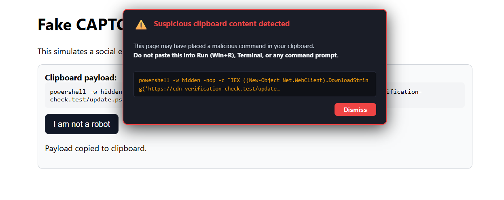

# Threat Sense

Threat Sense protects users from various scams and attacks from malicious or hijacked websites. When detected, the extension displays a warning overlay that persists until the user confirms they understand the risks.



## Architecture

### Threat Modules

- **Fake CAPTCHA**: Analyzes clipboard content for known attack patterns

### Core Components

- **Background Service Worker**: Coordinates detection and manages extension lifecycle
- **Event Bus**: Handles communication between components
- **Warning Overlay**: Provides user interface for threat warnings

## Privacy Standards

**No Data Transmission**: All analysis happens locally in your browser

**No Tracking**: No telemetry or analytics collection

**Open Source**: Code is transparent and auditable

**Verifiable Releases**: Builds are automated, signed, and have provenance attestation

### Permissions

| Permission | Purpose | Justification |
| ----------- | --------- | --------------- |
| `<all_urls>` | Run on all websites | Monitor and protect against attacks on any website the user visits |
| `clipboardRead` | Read clipboard content | Detect malicious content written to clipboard (local regex matching) |
| `scripting` | Inject scripts into web pages | Inject clipboard interceptor and warning overlay into pages |
| `tabs` | Query and interact with browser tabs | Determine which tabs are affected and coordinate responses |
| `activeTab` | Access to the currently active tab | Apply warnings and protections to the user's current tab |
| `storage` | Access to browser local storage | Store detection patterns, cache, and user preferences |
| `offscreen` | Create offscreen documents | Run background processes that don't require tab context |

## Installation

### From Chrome Web Store

One-click install from the [official Chrome Web Store listing](https://chromewebstore.google.com/detail/threat-sense/flppehegjoknbjamnimelolgnogloiad) is the safest and easiest way to install this extension.

New releases on CWS require a verified upload (signed by this repo's GitHub secret) and require FIDO2 authentication from my Google account prior to publishing. This means neither my GitHub account nor my Google account can compromise the extension alone; both are needed to publish a new release.

### From Release

1. Open [the latest release](https://github.com/lawndoc/threat-sense/releases/latest)
2. Download threat-sense-\<version>.crx
3. Navigate to [`chrome://extensions`](chrome://extensions)
4. Drag and drop the downloaded CRX file into the extensions page

### From Source

1. Clone this repository
2. Navigate to `chrome://extensions`
3. Enable "Developer mode" in the top-right corner
4. Click "Load unpacked"
5. Select the `src` folder from this project

## Usage

Once installed, Threat Sense works automatically:

1. **Background Protection**: The extension monitors all web pages you visit
2. **Threat Detection**: When a clipboard-hijacking attack is detected, a warning overlay appears
3. **User Confirmation**: Review the warning and confirm before proceeding with the paste
4. **Dashboard**: Click the Threat Sense icon to view extension status

## Browser Support

- **Primary**: Chromium-based browsers v144+
- **Planned**: Firefox

## Development

### Requirements

- Chrome/Chromium browser
- Basic knowledge of Chrome extension development
- Node.js lts (for running automated tests)

### Testing

Threat Sense includes comprehensive automated tests:

**Unit Tests** (Jest): Test detection logic in isolation
```bash
npm test
```

**Integration Tests** (Playwright): Test the full extension in a browser
```bash
npm run test:e2e
```

**Run all tests**:
```bash
npm run test:all
```

See [the `tests/` directory](tests/) for detailed testing documentation.

## License

AGPL-3.0

## Contributing

Contributions are welcome! Please feel free to submit issues and pull requests.

External contributions to detection logic is especially helpful as threats evolve.

## ***Disclaimer***

***This extension provides security protection but should not be considered a complete security solution. Always exercise caution when visiting unknown websites and pasting commands from untrusted sources.***
